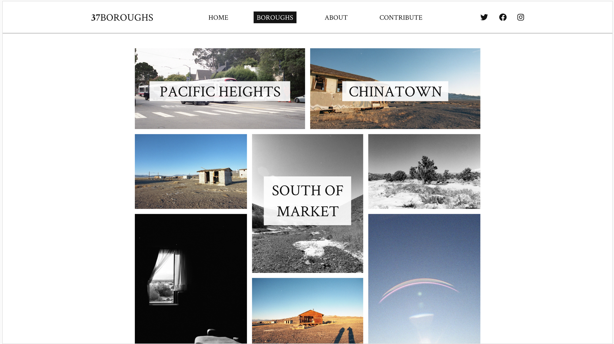
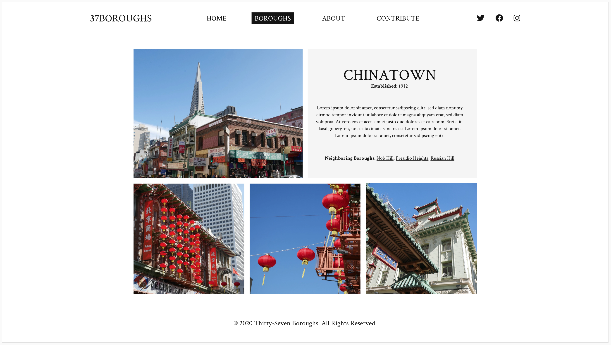
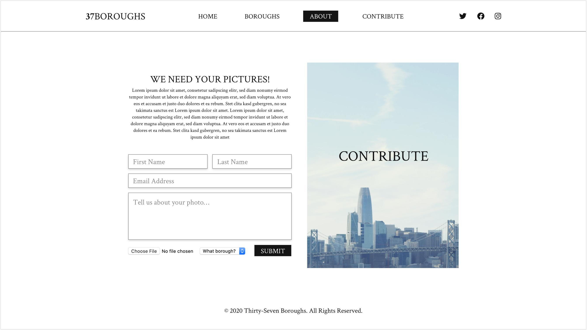
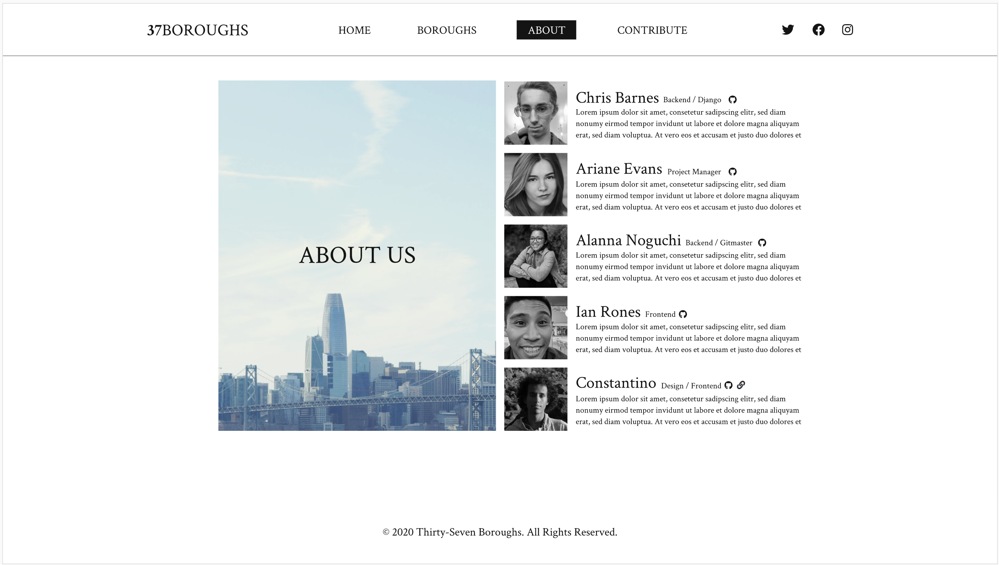

# Juniors Spring Intensive Deliverable Proposal [docs](https://docs.google.com/document/d/1HZw3gGhZRKYyghfaVIGJmSZxTE3iCgXHKlNHbU3Fk1c/edit)

Dates 3/16-3/25

**Team 11** 

**37 Boroughs** 

**Started in term 3, the team decided to continue to develop it.**

## Description

**Write a paragraph summary of the current status of your project, what you hope to achieve during the intensive, how and why**

[Key demographic: Photographers, Travelers, Business Owners]

[Wider demographic: anyone who is interested in San Francisco or photography]

37Boroughs helps them
- Know where to go with our list of boroughs and information about them
- Know what they’ll see with the pictures of those boroughs
- Find local hidden gems as our pictures show more than just the tourist traps]

## Skateboard

**ONE SINGLE aspect of product. Consider: build backend for SPD 1.2 front end, CRUD one resource, use API or library, authentication etc.**

Base rendering of the website, allow CRUD on boroughs, Add user contribution, add population API

## Bike
**ONE additional features that get you closer to your idealized product. Examples: CRUD 2nd resource, add comments, API use, authentication, library use** 

Add google maps API, polish out styles of the front end, and user accounts

## Car
**ONE additional feature** 

Add the possibility to like and save pictures to ones account

## Personal Achievement Goals:

**Each teammate must achieve 2 of 3 of their self-set personal achievement goals. If you're not on a team, delete the other teammate sections as needed.**

### Chris Barnes' Goals

1. Fix GitHub commits and create branches
2. Make user accounts
3. Help implement google maps API
4. Add website caching
5. Adjust account for team access

#### Challenges Chris Anticipates
- Need to rebase commits and separate local and hosted databases
    - Going to request help from a ta or instructor
- Do more research and practice on setting up API and how to speed them up by caching their data

### Ariane Evans' Goals

1. Create safe psychological environment for team to work in
2. Get each member on the team to fulfil at least one of their individual goals for this project
3. Help in improving and implementing front end whenever needed

#### Challenges Ariane Anticipates

### Teammate 3: Alanna Nochie's Goals

1. Goal 1
1. Goal 2
1. Goal 3

#### Challenges Alanna Anticipates

### Teammate 4: Ian Rones' Goals

1. Goal 1
1. Goal 2
1. Goal 3

#### Challenges Ian Anticipates

## Wireframes

**Insert wireframe pictures here**

## Evaluation

**You must meet the following criteria in order to pass the intensive:**

- Students must get proposal approved before starting the project to pass
- SOLO 
    - must score an average above a 2.5 on the [rubric]
- TEAM 
    - Must score an average above 3 on the [rubric]
    - Each individual completes 2 of the 3 personal achievement goals from their proposal
- Pitch your product

[rubric]:https://docs.google.com/document/d/1IOQDmohLBEBT-hyr-2vgw1mbZUNsq3fHxVfH0oRmVt0/edit

## Approval Checklist
- [ ] If I have a team project, I wrote this proposal to represent my work and only my work
- [ ] I have completed all the necessary parts of this proposal
- [ ] I linked my proposal in the Spring Intensive Tracker

### Sign off

**Student Name:**                
> Name / Date
**Make School Advisor Name**
> TBD